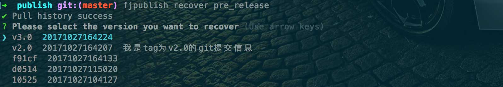

# 配置文件 api

## module 参数

### env

类型：`String`

发布环境的唯一标识符。

### name

类型：`String`

设置发布环境的名称易于辨识，如：测试环境。

### ssh

类型：`Object`

基于[ssh2](https://github.com/mscdex/ssh2)库的配置项完成上传远程机器目录和执行远程操作，通常情况下只需要配置`host`、`username`、`password`等，安全配置请查看‘[关于安全](/safe.md)’小节。

```js
ssh: {
    host: '192.168.0.xxx',
    username: 'root',
    //rc版本的user选项和userName选项请在未来统一配置为username
    password: 'xxxx',
}
```

### buildCommand

类型：`String`

fjpublish 会根据该选项结合[npm script](http://www.ruanyifeng.com/blog/2016/10/npm_scripts.html)执行构建命令。
例如，配置`buildCommand`为'build'则构建命令为`npm run build`

### nobuild

类型：`Boolean`

若项目没有需要构建的需求或当次发布时已经不需要构建则设置该项为 true, 默认需要构建。
可以通过`fjpublish env <env> --nobuild`命令快捷设置

### localPath

类型：`String`

要发布的文件夹根目录，支持绝对路径和相对路径，建议使用相对路径。
默认取值为当前工作目录，但是为了防止忘记配置该项导致把 node_modules 上传，所以当`localPathEntries`未配置时，此项必须配置，若真的需要把当前工作目录整个发布，请配置为“.”，当`localPathEnries`已配置时，该项可忽略并且默认为当前工作目录。

### localPathEntries

类型：`String|Array<String>`

fjpublish 使用的打包工具为[tar-fs](https://github.com/mafintosh/tar-fs)，所以这里`localPathEntries`的概念就是**tar-fs**中 entries 的概念。
对于要发布多个文件(夹)到远程环境，则配置此项为一个`localPath`根路径下的一个或多个子目录，则发布后远程文件夹将以这些子文件(夹)（而不是`localPath`）作为备份源。

```js
localPathEntries: ['static', 'dist', 'index.html']
```

### localPathIgnore

类型：`String|Array<String>|Function`

fjpublish 使用的打包工具为[tar-fs](https://github.com/mafintosh/tar-fs)，所以这里`localPathIgnore`的概念就是**tar-fs**中 ignore 的概念。
同时 fjpublish 也增强了它，允许并建议使用通配符来忽略某些文件上传，参考[multimatch](https://github.com/sindresorhus/multimatch)。这样做的好处是若该项不设置为函数时 fjpublish 能正确的区分不同环境的打包的代码和上传的代码任务是否有相同的，相同则忽略，减少重复任务，若设置为函数则无法区分，这对一次发布多个环境的速度而言还是有影响的。
例如：忽略任意文件夹下.map 后缀的文件上传：

```js
localPathIgnore: '**/*.map'
```

### localPathMap

fjpublish 使用的打包工具为[tar-fs](https://github.com/mafintosh/tar-fs)，所以这里`localPathIgnore`的概念就是**tar-fs**中 map 的概念。
通常这用于设置文件权限等，fjpublish 默认的文件权限为：文件（0644）文件夹（0755），所属用户为 ssh 设置登录的用户。
其他用途请查看 tar-fs 的文档，下面举一个修改文件权限的例子：

```js
localPathMap(header){
    header.mode = 0700 //设置文件(夹)的权限为700
    return header;
}
```

### localTarFileDir

类型：`String`

压缩后的文件放置目录， 可以设置绝对或相对路径，默认为系统的 tmp 目录。

### tarFilename

类型：`String`

压缩后的文件名，不含后缀部分，默认为 fjpublish 根据每个环境发布的文件异同生成的一个 fjcompress{索引}.tar.gz，索引从 0 自增。

### remotePath

类型：`String`

要发布到远程服务器的路径，必须是一个二级及以上的绝对目录路径，例如：'/abc/cde'。
当需要发布单个目录到远程服务器是应该把其理解为平级目录，`localPath`中定义的目录将与其替换。
当需要发布多个目录到远程服务器是应该把其理解为父目录，`localPathEntries`中定义的目录将放置入其中。

### remoteTarFileDir

类型：`String`

发布时上传压缩包到远程机器的目录，当自定义时必须是一个二级及以上的绝对目录路径，例如：'/abc/cde'， 默认为'/tmp'。

### shellTrashPath

类型：`String`

当**module**的`nobackup`设置为 true 时，fjpublish 进行软删除的后文件的放置地址，当自定义时必须是一个二级及以上的绝对目录路径，例如：'/abc/cde'， 默认为'/tmp/fjpublishTrashDir'。

### ssh2shell

类型：`Object`

fjpublish 使用[ss2shell](https://github.com/cmp-202/ssh2shell)库来完成远程命令的操作，且默认情况下每一个命令都没有做异常判断，只是按顺序执行，通常这没有什么问题，如果你需要对每一个命令进行控制，请参考 ss2shell 的文档进行进程管理。
同时这个字段也常用于设置远程命令超时时间，默认为 10 秒。
注意，这个字段请传 ss2shell 可配置的字段中除了 server，commands 以外的剩余字段。

```js
ssh2shell: {
    onCommandComplete: function(command, response, sshObj) {
        if (command === 'cd /xxx/xxx/xxx') {
            process.exit(1);
        };
    },
    idleTimeOut: 20000 //设置超时20秒
},
```

### tag

类型：`String|Function`

标记当次发布的标签，可用于在快速还原时找到对应标签等，通常这在当次发布过程这个值没有什么作用，默认为当前时间戳的 md5 值。
例如，在下图第一列显示的就是 tag 标记的值。

<center>
  
</center>

它也一些小技巧，例如将其设置为函数，并与 git 的版本号关联起来，这样就能在还原时根据 git 版本号还原。

```js
tag(module, env, fj) {
    return module._commit || false; //不一定每一次发布都会使用fjpublish的git流程，所以返回一个非字符串的值回退到fjpublish为其设置的默认值
}
```

建议通过命令`fjpublish env <env> -t, --tag <message>`命令设置 tag 值。

### extractVerbose

类型：`Boolean`

设置为 true 则发布时进行远程环境解压包操作时显示解压文件，默认不显示。

### preCommands

类型：`String|Array<String>`

远程 fjpublish 内部命令执行前的命令。

### postCommands

类型：`String|Array<String>`

远程 fjpublish 内部命令执行后即远程项目文件替换后执行的 linux 命令，例如，重启 pm2 服务器：

```js
postCommands: ['pm2 restart']
```

### nobackup

类型：`Boolean`

发布时是否备份旧文件。默认进行备份，备份方式为例如 abc 文件将被备份为 abc.{时间戳}。
若选择不备份，fjpublish 为了安全起见是进行软删除， 即使用 mv 命名移动至`shellTrashPath`设置的目录，默认为**'/tmp/fjpublishTrashDir'**，例如备份/www/test/abc，则将其移动至/tmp/fjpublishTrashDir/www.test.abc.{时间戳} 。
可以通过`fjpublish env <env> --nobackup`命令快捷设置

### merge

类型：`Boolean`

发布项目到远程环境时新旧文件的替换方式默认为完整替换，设置该项为 true 可进行新旧文件 merge 操作。
例如 webpack 构建文件后会对文件进行 hash 操作，这样如果不 merge 发布则发布过程中正在浏览网站的人会出现文件不存在的错误。
这里有一篇[文章](http://web.jobbole.com/83392/)提到非覆盖式发布的好处。
可以通过`fjpublish env <env> --merge`命令快捷设置

### diff

类型：`Boolean`

开启差异化（diff）发布，发布项目时只上传有改动或新增的文件，这样做能大大提升项目上传的速度。
使用该功能需要了解以下几点：

- 文件提取时是智能的，原理为通过比对当次发布与远程文件**上一次**发布时上每一个文件的‘指纹’选出需要发布的文件，且发布时自动设置`merge`为 true 这样就完成了差异化发布。

- 如果禁用历史记录功能，或者共同维护项目的同事不使用 fjpublish 进行发布或他也禁用历史功能，那么该选项将得不到预期的效果；

- 通常在内网环境及小体积的项目中这样做的速度提升不明显，所以请根据实际情况设置，通常只在发布生产环境使用。

可以通过`fjpublish env <env> -d, --diff`命令快捷设置。

### prompts

类型：`Array<Object>`

fjpublish 使用的提示器为[Inquirer](https://github.com/SBoudrias/Inquirer.js)，fjpublish 会将`prompts`数组原封不动的传给**Inquirer**来生成提示器。
配置提示器可以通过命令行的方式获取 module 所需的参数，在 module 中配置的提示器只会影响该 module，在 config 配置的提示器会影响 metadata，或也可配置影响每一个 module。
提示器只会在**prompt**中间件中进行一次性询问，一次性收集在 config 中定义的 prompts 及每一个发布的 module 的 prompts。
这里有一个自定义提示器的[例子](/example/prompt.md)。

### beforeHooks

类型：`Object|Array<Object>`

为 fjpublish 的中间件设置前置钩子函数。
值得注意的是`beforeHooks`和`afterHooks`一样遵守继承的原则，所以可以根据需要把它们灵活配置在**module**或**config**中。

`when`: (String)
设置在哪一个中间件前使用这个钩子函数，默认可选项为**pull**(拉取 fjpublish 记录)、**prompt**(提示器)、**git**(git)、**builder**(构建)、**compress**(打包)、**sftp**(上传)、**shell**(远程操作)、**push**(提交 fjpublish 记录)。

`fn`: (Function)
钩子函数的规则和中间件函数规则类似，必须显式的调用 next 进入下一个阶段，否则后续中间件无法执行。

### afterHooks

类型：`Object|Array<Object>`

和`beforeHooks`类似，区别在于该项配置的是一个后置钩子函数。
实时上钩子函数和中间件都是函数，都需要在内部显式调用 next 方法才能执行后一个流程，只是在设计上两者意义是不同的： 1.中间件是 fjpublish 官网发布时已经挂载好的流程，只能忽略或替换，且必须是一个具名函数以便钩子函数挂载。 2.钩子函数是使用者在 fjpublish 原有功能上进行拓展使用的，可以是匿名函数。
例如配置一个简单的在发布选择完毕后显示发布配置的功能，效果请前往这个[例子](/example/hook.md)查看：

```js
afterHooks: {
    when: 'prompt',
    fn({ name, ssh: { host }, localPath = '.', localPathEntries = [], remotePath, nobackup = false, nobuild = false, nomerge = true }, env, next) {
        console.log(`Config: ...
name: %s
env: %s
host: %s
======
local path: %s
local entries: %s
remote path: %s
======
nobuild: %s
nobackup: %s
nomerge: %s
`, name, env, host, localPath, localPathEntries, remotePath, nobuild, nobackup, nomerge);
        next();
    },
}
```

### recoverTemplate

类型：`Function`

自定义快速还原命令`fjpublish recover <env>`的模板。

```js
recoverTemplate(module, record, chalk) {
    return `${chalk.yellow(record.tag)} ${record._backupExt} ${record.v.gitMessage || ''}`;
}
```

### middlewareUse

类型：`String|Array<String>`

用于决定某个**module**的发布任务使用哪些已挂载的中间件，**通常不用设置此项，只为了解锁更多可能**。
默认可选项为**pull**(拉取 fjpublish 记录)、**prompt**(提示器)、**git**(git)、**builder**(构建)、**compress**(打包)、**sftp**(上传)、**shell**(远程操作)、**push**(提交 fjpublish 记录)。

### middlewareIgnore

类型：`String|Array<String>`

类似于`middlewareUse`，用于决定某个**module**的发布任务不使用哪些已挂载的中间件，**通常不用设置此项，只为了解锁更多可能**。
注意`middlewareUse`和`middlewareIgnore`配置后等同于卸载了某些中间件，所以在配置中可能某些挂载在这些中间件的钩子函数会失效，所以请谨慎配置。
例如要忽略**builder**中间件带来的构建流程请使用`nobuild`选项，这样**builder**中间件依然存在，只简单的跳过了中间件函数内部的核心操作。

### middlewareReplace

类型：`Object|Array<Object>`

对于官网默认的中间件如果觉得不好用，有以下方法解决：

1.fork 下来重新组装，二次封装一个新的；

2.使用`middlewareIgnore`忽略，然后再用钩子函数挂载新的上去（不建议）；

3.使用`middlewareReplace`，顾名思义，使用新的中间件替换旧的，名称可以不同。

`name`: (String)
设置要替换哪个中间件，默认可选项参考`middlewareUse`。

`middleware`: (Function)
新的中间件函数，必须是一个具名函数。

```js
middlewareReplace: {
    name: 'git',
    middleware: function newGit(module, env, next) {
        console.log('new git');
        next();
    }
}
```

## config 参数

module 中的参数均可在 config 中配置，表示继承关系，参考[`配置文件结构`](/config.html)

### prompts

类型：`Array<Object>`

配置方式参考 module 中的`prompts`配置，区别在于 config 中的`prompts`默认只为 metadata 赋值。

### promptSyncModule

类型：`String|Array<String>`

由于希望完成提示一次即可为每一个**module 实例**赋值的需求，所以需要通过该项决定在**config**中配置的`prompts`哪一项需要同步到每一个**module 实例**。

### promptIgnore

类型：`String|Array<String>`

可以忽略**config**中配置的`prompts`，匹配`prompts`子元素的 name 字段。
通常用于在命令`fjpublish env <env> -p`中忽略官方预先设置的`nobuild`、`nobackup`、`nomerge`等觉得非必要的提示器。

### parallel

类型：`Boolean`

fjpublish 默认使用的是串行完成每一个任务，也可以设置该项为 true 来并行进行发布任务。
不过 fjpublish 已经在每一个环节考虑到了避免重复任务所以通常并不需要设置该项，而且串行的输出更直观，并行输出会比较混乱。
但是事实是并行会比串行快一丢丢，如果还设置了钩子函数且执行一些异步高耗时操作时这个差距会更大。

### gitCommit

类型：`String|Function`

注意，fjpublish 默认情况下 git 流程是不开启的，只有直接设置或通过命令设置了该选项才会启用 git 流程。
该选项代表的 git 流程为 git add . 和 git commit -am "xxx"
该选项接收一个字符串(或通过函数返回的字符串)作为 commit 的 message, 如果接收到非字符串或者隐私转换为 false 的值则 message 将为'update'。
建议使用命令`fjpublish env <env> --commit [msg]`来设置此项。

### gitPush

类型：`Boolean`

请在`gitCommit`已经设置的基础上再设置此项。
该选项代表的 git 流程为 git pull origin '当前分支' 和 git push origin '当前分支'
建议使用命令`fjpublish env <env> --commit [msg] --push`来设置此项。
fjpublish 提供的 git 流程比较基本，这也是为什么默认不使用 git 的原因，如果需要非常复杂的 git 操作，还是建议先进行 git 操作再发布代码。
git 中间件处于构建中间件前，且在 git 出错或有冲突时不会执行后续流程并给出提示，所以不用担心在 git pull 远程分支有冲突时还会执行后续操作。

### check

类型：`Boolean`

配置该项为 true 可跳过每一个中间件的文件操作环节而不用担心因为配置错误而导致的后果，通常用于快速检查参数是否配置正确。

### checkUpdate

类型：`Boolean`

是否在发布任务完成后检查 fjpublish 是否有更新的版本，默认为 true，进行检查。

### usePrompt

类型：`Boolean`

配置该项为 true 则使用提示器的方式进行发布，默认不启用。
可以通过命令`fjpublish env <env> -p`快捷进行设置

### completeHook

类型：`Function`

所有任务完成时触发，可以配合`check`选项来打印出数据并检查。

```js
completeHook(fjpublish, result) {
    console.log(fjpublish._metadata);
    console.log(result);
}
```

### startHook

类型：`Function`

在 fjpublish 实例化后即将开始发布任务前的钩子函数。
