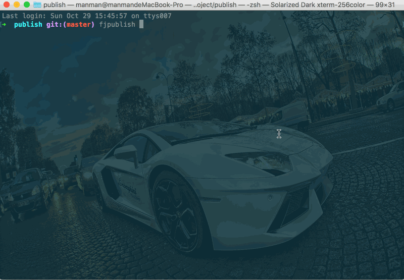

# 简单例子

任务描述：

- 以提示器的方式选择发布到测试环境。

## 配置文件

```js
// 项目根目录下fjpublish.config.js
module.exports = {
  modules: [
    {
      name: '测试环境',
      env: 'test',
      ssh: {
        host: '192.168.0.xxx',
        port: 22,
        username: 'root',
        //rc版本的user选项和userName选项请在未来统一配置为username
        password: 'xxxxxx'
      },
      buildCommand: 'webpack',
      localPath: 'example',
      remotePath: '/www/manman/test'
    },
    {
      name: '预发布环境',
      env: 'pre_release'
      //剩余配置参考‘测试环境’
    },
    {
      name: '正式环境',
      env: 'pre_release'
      //剩余配置参考‘测试环境’
    }
  ]
}
```

```json
// 项目根目录下package.json
// 用于使用构建命令npm run webpack来调用webpack
...
"scripts": {
    "webpack": "webpack --config example/webpack/build/build.js"
},
...
```

## 发布命令

```
fjpublish env -s
```

## 动态图

<center>
   
</center>
<center><font color="#999" size=4>简单例子</font></center>

## 更多

- 可以使用命令[`fjpublish env <env> --diff`](/guide/use.html#d-diff-env)开启差异化发布，每次发布只上传有改动的文件，极大的缩短上传时间。

- 对于不需要构建的项目，不需要准备 package.json，并在配置文件中设置[`nobuild`](/api/#nobuild)选项；

```js
nobuild: true
```

- 对于某次发布临时不需要构建的，请在命令中使用[`--h`](/guide/use.html#nobuild-env)选项

```
fjpublish env <env> --nobuild
```
