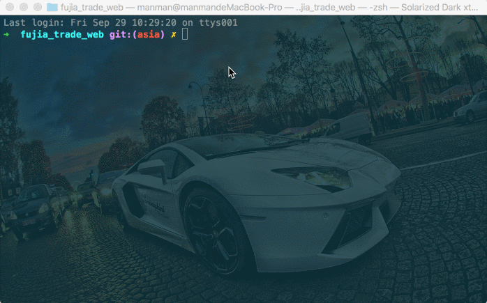

# 远程后置命令

任务描述

- 使用**module**的配置项[`postCommands`](/api/#postcommands)在项目发布后重启 pm2 进程；

- 忽略当次构建过程并提交一次 git；

- 使用**module**的配置项[`ssh2shell`](/api/#ssh2shell)设置每个远程命令超时时间为 20 秒。

## 配置文件

```js
// 项目根目录下fjpublish.config.js
module.exports = {
  modules: [
    {
      name: '测试环境',
      env: 'test',
      ssh: {
        host: '192.168.0.xxx',
        port: 22,
        username: 'root',
        //rc版本的user选项和userName选项请在未来统一配置为username
        password: 'xxxxxx'
      },
      ssh2shell: {
        idleTimeOut: 20000
      },
      postCommands: ['pm2 reload xxx'],
      buildCommand: 'build',
      localPath: 'example',
      remotePath: '/www/manman/test'
    }
  ]
}
```

## 发布命令

```
fjpublish env test --nobuild --commit '远程后置命令'
```

## 动态图

<center>
   
</center>
<center><font color="#999" size=4>远程后置命令</font></center>
