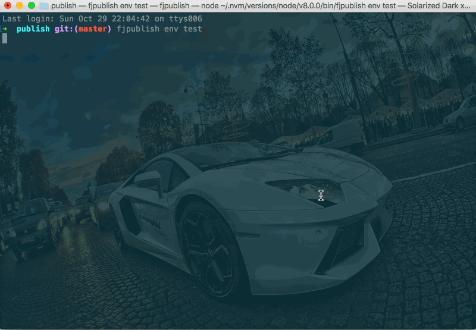

# 多目录发布

任务描述：

- 使用**module**的[`localPathEntries`](/api/#localpathentries)来发布多个目录；

- 使用**module**的[`localPathIgnore`](/api/#localpathignore)忽略所有 txt 结尾的文件。

## 项目文件结构

<center>

</center>

## 配置文件

```js
// 项目根目录下fjpublish.config.js
module.exports = {
  modules: [
    {
      name: '测试环境',
      env: 'test',
      ssh: {
        host: '192.168.0.xxx',
        port: 22,
        username: 'root',
        //rc版本的user选项和userName选项请在未来统一配置为username
        password: 'xxxxx'
      },
      buildCommand: 'webpack',
      localPathEntries: ['example', 'lib'],
      localPathIgnore: '**/*.txt',
      remotePath: '/www/manman/multiple'
    }
  ]
}
```

## 发布命令

```
fjpublish env test
```

## 动态图

<center>
   
</center>
<center><font color="#999" size=4>多目录发布</font></center>

## 更多

- 如果把配置改一下，那么发布的项目结构将完全不同，那么聪明的你猜猜修改上文配置的`localPath`和`localPathEntries`会发生什么吧；

```js
...
localPath: 'example/webpack',   //当localPathEntries存在时localPath可不填，不填意味着项目根目录
localPathEntries: ['build', 'dist'],
...
```

- 若项目为多目录发布，则远程目录的备份规则也将变为以这些子目录为备份源。
  <center>
     
  </center>
