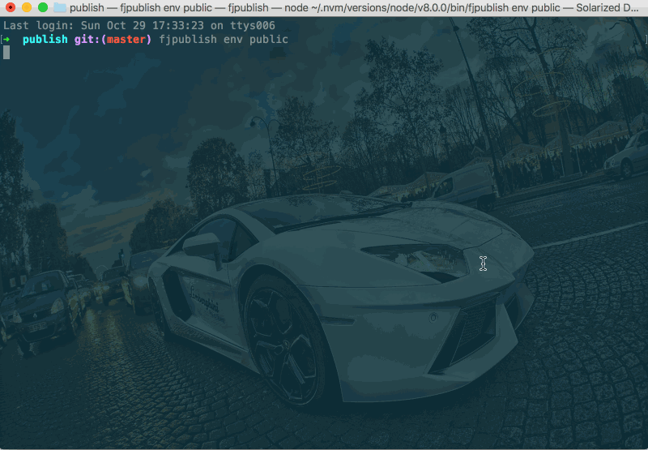

# 钩子函数

任务描述：

- 给所有环境增加一个显示当前发布环境信息的钩子；

- 给生产环境增加一个专属的上传 cdn 操作的钩子，放在构建中间件结束后，压缩中间件前。

## 配置文件

```js
// 项目根目录下fjpublish.config.js
module.exports = {
    modules: [{
        name: '测试环境',
        env: 'test',
        ssh: {
            host: '192.168.0.xxx',
            port: 22,
            username: 'root',
            //rc版本的user选项和userName选项请在未来统一配置为username
            password: 'xxxxxx',
        },
        buildCommand: 'webpack',
        localPath: 'example',
        remotePath: '/www/manman/test',
    },{
        name: '预发布环境',
        env: 'pre_release',
        ... //其他参数参考测试环境
    },{
        name: '生产环境',
        env: 'public',
        ... //其他参数参考测试环境
        beforeHooks: {
            when: 'compress',
            fn(module, env, next) {
                console.log('上传cdn操作完毕') //这里略过上传cdn的写法，自由发挥
                next();
            }
        },
    }],
    afterHook: {
        when: 'prompt',
        fn({ name, ssh: { host }, localPath = '.', localPathEntries = [], remotePath, nobackup = false, nobuild = false, merge = true }, env, next) {
            console.log(`Config: ...
    name: %s
    env: %s
    host: %s
    ======
    local path: %s
    local entries: %s
    remote path: %s
    ======
    nobuild: %s
    nobackup: %s
    nomerge: %s
    `, name, env, host, localPath, localPathEntries, remotePath, nobuild, nobackup, merge);
            next();
        },
    }
}
```

## 发布命令

```
fjpublish env public
```

## 动态图

<center>
   
</center>
<center><font color="#999" size=4>钩子函数</font></center>

## 更多

- 编写钩子函数请戳[这里](/guide/advanced.html#编写一个中间件或钩子函数)；

- 钩子函数配置在**config**则影响每一个发布环境，配置在**module**中只影响当前环境。

- **module**与**config**中如果同时配置了`beforeHooks`或`afterHooks`，那么 module 中的会生效，所以需要灵活配置流程，避免覆盖。
