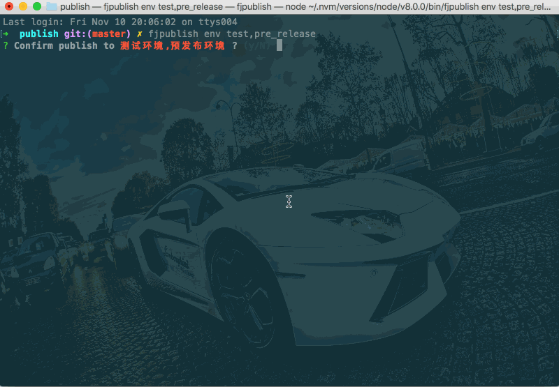

# 多环境发布

任务描述：

- 同时发布项目至测试环境和预发布环境中；

- 通过[配置文件](/config.html)的可继承规则把每个**module**中需要重复配置的选项统一配置在**config**中；

- 通过**connfig**配置`nohistory`永久禁用历史记录功能。

## 配置文件

```js
// 项目根目录下fjpublish.config.js
module.exports = {
    modules: [{
        name: '测试环境',
        env: 'test',
        ssh: {
            host: '192.168.0.xxx',
            port: 22,
            username: 'root',
            //rc版本的user选项和userName选项请在未来统一配置为username
            password: 'xxxxxx',
        },
    }, {
        name: '预发布环境',
        env: 'pre_release',
        ... //其他参数参考测试环境
    }],
    nohistory: true,
    buildCommand: 'webpack',
    localPath: 'example',
    remotePath: '/www/manman/test',
}
```

## 发布命令

```
fjpublish env test,pre_release
```

## 动态图

<center>
   
</center>
<center><font color="#999" size=4>多环境发布</font></center>

## 更多

- 默认情况下是串行发布多个多个环境，若要并行发布，请配置**config**的[`parallel`](/api/#parallel)或使用命令选项[`--parallel`](/guide/use.html#parallel)；

- fjpublish 已经考虑好了在发布多环境时避免构建、打包、git、上传环境重复工作（在动态图看到只进行了一次构建以及压缩的文件都是 fjcompress0.tar.gz 可以证明这一点），所以不用刻意配置忽略选项。

- 禁用历史记录功能后使用将影响 diff 发布及快速还原功能。
