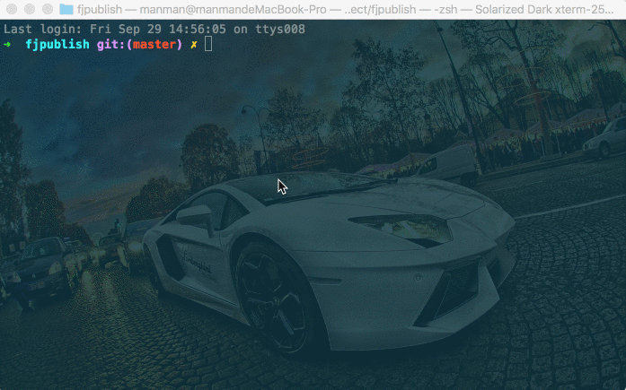

# 编程式发布

任务描述：

- 以编程的方式发布项目。

- 重新组装中间件并添加一个[自定义](/advanced.html)中间件。

## 配置文件

```js
// 项目根目录下fjpublish.config.js
module.exports = {
  modules: [
    {
      name: '测试环境',
      env: 'test',
      ssh: {
        host: '192.168.0.xxx',
        port: 22,
        username: 'root',
        //rc版本的user选项和userName选项请在未来统一配置为username
        password: 'xxxxxx'
      },
      buildCommand: 'webpack',
      localPath: 'example',
      remotePath: '/www/manman/test'
    }
  ]
}
```

```js
// 项目根目录下test.js
const Fjpublish = require('Fjpublish')
const prompt = require('Fjpublish/lib/fjpublish_prompt.js')
const builder = require('Fjpublish/lib/fjpublish_builder.js')
const compress = require('Fjpublish/lib/fjpublish_compress.js')
const sftp = require('Fjpublish/lib/fjpublish_sftp.js')
const shell = require('Fjpublish/lib/fjpublish_shell.js')
const config = require('./fjpublish.config.js')

Fjpublish(config)
  .use(prompt)
  .use(test)
  .use(builder)
  .use(compress)
  .use(sftp)
  .use(shell)
  .start()

function test(module, env, next) {
  console.log('我正在发布' + env + '环境')
  next()
}
```

## 发布命令

```
node test.js
```

## 动态图

<center>
   
</center>
<center><font color="#999" size=4>编程式发布</font></center>
