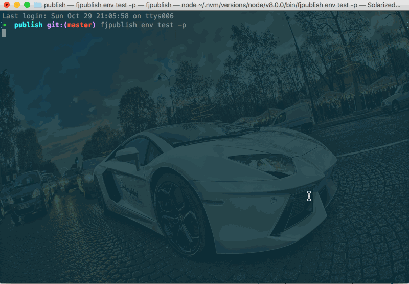

# 自定义提示器发布

任务描述：

- 使用[提示器](/guide/use.html#p-prompt)的方式来为`tag`和`gitMessage`赋值；

- 使用**config**的[`promptIgnore`](/api/#promptignore)忽略官方预先设置的提示器之一[`nobuild`](/api/#nobuild)

## 配置文件

```js
// 项目根目录下fjpublish.config.js
module.exports = {
  modules: [
    {
      name: '测试环境',
      env: 'test',
      ssh: {
        host: '192.168.0.xxx',
        port: 22,
        username: 'root',
        //rc版本的user选项和userName选项请在未来统一配置为username
        password: 'xxxxx'
      },
      prompts: [
        {
          type: 'input',
          name: 'tag',
          message: '设置tag值'
        }
      ],
      buildCommand: 'webpack',
      localPathEntries: ['./example/'],
      remotePath: '/www/zhangchao/test'
    }
  ],
  promptIgnore: 'nobuild',
  prompts: [
    {
      type: 'input',
      name: 'gitCommit',
      message: '设置提交的git值'
    }
  ]
}
```

## 发布命令

```
fjpublish env test --check -p
```

## 动态图

<center>
   
</center>
<center><font color="#999" size=4>自定义提示器发布</font></center>

## 更多

- 默认情况下官方设置了三个提示器，分别对应[`nobuild`](/api.html#nobuild)、[`nobackup`](/api.html#nobackup)、[`merge`](/api.html#merge),可以设置[`promptIgnore`](/api.html#promptignore)禁用默认的提示器；

- 默认情况下在**config**中定义的提示器只为**metadata**赋值，也可以在**config**配置[`promptSyncModule`](/api.html#promptsyncmodule)显式声明哪些提示器的值需要同步到每一个**module 实例**。
