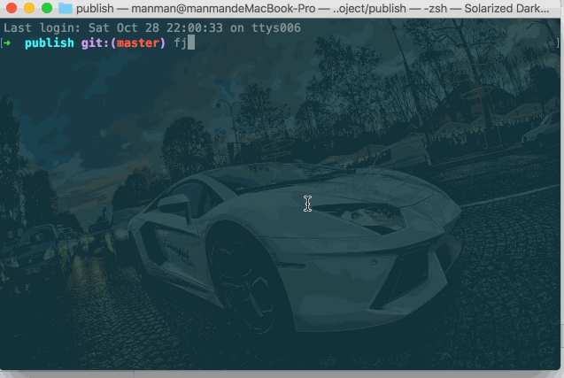

# 快速还原

任务描述：

- 还原版本预发布环境至`tag`标记为‘自定义 tag 的版本’的版本；

## 配置文件

```js
// 项目根目录下fjpublish.config.js
module.exports = {
  modules: [
    {
      name: '预发布环境',
      env: 'pre_release',
      ssh: {
        //略
      },
      localPath: 'example',
      remotePath: '/www/zhangchao/pre_release'
    }
  ]
}
```

## 还原命令

```
fjpublish recover pre_release
```

## 动态图

<center>
   
</center>
<center><font color="#999" size=4>快速还原</font></center>

## 更多

- 可以使用命令`fjpublish recover pre_release -p, --previous` 快速还原至上个版本而不需要选择；

- 可以使用选项[`recoverTemplate`](/api/#recovertemplate)自定义版本列表模板。
