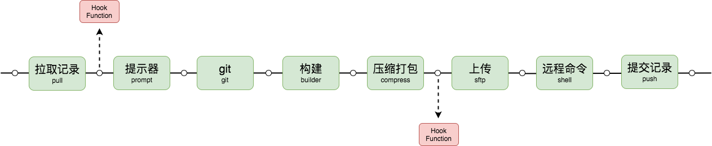

# 发布流程

## 发布流程图示

下图说明了发布一个远程环境所经历的流程，**若同时发布多个远程环境，则相当于执行多条相互独立的流程**。

需要对图示作以下说明：

- 图中绿色的模块为**官方默认**的发布功能模块，称之为中间件；

- 图中红色的模块为通过**配置文件**选项[`beforeHooks`](/api/#beforehooks)或[`afterHooks`](/api/#afterhooks)挂载在**任意一个**官方中间件前后的自定义函数，称之为钩子函数。

- 中间件和钩子函数在[编写方式](/guide/advanced.html)上是一样的，所以可以理解为中间件是官方默认的，钩子函数是使用者通过配置文件自定义插入流程中的中间件。

## 默认中间件

简单说明官方默认中间件的功能：

- **拉取记录（pull）**：从远程环境拉取历史记录(是 fjpublish 的记录而不是 git 记录)，用于开启[`diff`](/api/#diff)发布和快速还原等功能，可以设置[`nohistory`](/api/#nohistory)不拉取历史记录；

- **提示器（prompt）**：使用提示的方式为发布流程设置某些值，默认不[启用](/api/#useprompt)，可以[自定义](/api/#prompts)提示器，官方默认提供了[`nobuild`](/api/#nobuild)、[`merge`](/api/#merge)、[`nobackup`](/api/#nobackup)的提示器；

- **git（git）**：提供基础的[commit](/api/#gitcommit)和[push](/api/#gitpush)功能，默认不启用；

- **构建（builder）**：通过[npm script](http://www.ruanyifeng.com/blog/2016/10/npm_scripts.html)的方式执行构建命令，可以通过选项[`nobuild`](/api/#nobuild)跳过构建；

- **压缩打包（compress）**：把需要上传到远程环境的文件压缩打包为 xxx.gz；

- **上传（sftp）**：把 compress 中间件打包好的 xxx.gz 文件上传到远程环境的一个 tmp 目录；

- **远程命令（shell）**：把远程旧文件备份，然后通过解压的方式把 tmp 目录中的 xxx.gz 里的新文件解压到对应的地方，同时还可以选择配置[`postCommands`](/api/#postcommands)在远程服务器文件替换完毕后做些什么；

- **提交记录（push）**：将当次发布过程需要记录(是 fjpublish 的记录而不是 git 记录)的发布信息发送到远程环境，通常用于搭配 pull 中间件使用，可以设置[`nohistory`](/api/#nohistory)不提交历史记录；
