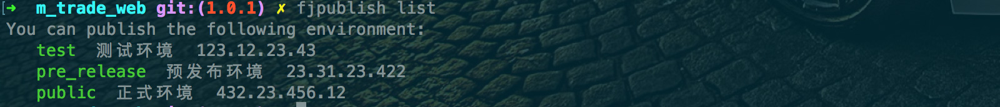
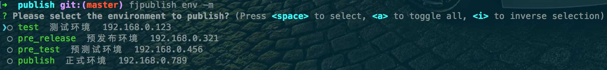

# 使用方式

如果你已经在项目根目录准备好了一个[配置文件](/guide/config.html)（默认 fjpublish.config.js）并已经[配置](/api/)妥当，那么你就可以发布项目了。
事实上，fjpublish 命令行中部分选项都是为配置文件设置或覆盖值，所以应当理解为需要临时设置或覆盖值的选项应当在命令行中设置，需要长期设置值的选项在配置文件中设置

## fjpublish

没有任何功能，等同于输入 fjpublish -h。

### `--config`

选择其他的文件替代默认的 fjpublish.config.js 文件。

### `-h, --help`

获得**fjpublish**的帮助。

## fjpublish init

在当前工作目录生成一份参考配置文件 fjpublish.config.js。

## fjpublish list

列出当前配置文件中配置的发布的环境。

 

 
 

## fjpublish env [env][options]

选择发布至配置好的某些环境（可多选，英文逗号分隔），在`-s, --select`或`-m, --multiple`选项给出时 env 是不必填的，否则必填。例如`fjpublish env test,public`或`fjpublish env -s`。

  

  
  

### `-h, --help`

获得**fjpublish env**的帮助。

### `-s, --select`

以单选提示器的方式选择发布环境。

  

  
  

### `-m, --multiple`

以多选提示器的方式选择发布环境, 单选和多选只需要配置其中之一即可。

  

  
  

### `--nobuild [env]`

等同于为每一个**module 实例**设置了[`nobuild`](/api/#nobuild)=true，若配置 env 参数（可多选，英文逗号分隔），则只对 env 参数对应的环境设置值。

### `--nobackup [env]`

等同于为每一个**module 实例**设置了[`nobackup`](/api/#nobackup)=true，若配置 env 参数（可多选，英文逗号分隔），则只对 env 参数对应的环境设置值。

### `--merge [env]`

等同于为每一个**module 实例**设置了[`merge`](/api/#merge)=true，若配置 env 参数（可多选，英文逗号分隔），则只对 env 参数对应的环境设置值。

### `-d, --diff [env]`

等同于为每一个**module 实例**设置了[`diff`](/api/#diff)=true，若配置 env 参数（可多选，英文逗号分隔），则只对 env 参数对应的环境设置值。

### `--nohistory [env]`

等同于为每一个**module 实例**设置了[`nohistory`](/api/#nohistory)=true，若配置 env 参数（可多选，英文逗号分隔），则只对 env 参数对应的环境设置值。

### `-t, --tag <message>`

等同于为每一个**module 实例**设置了[`tag`](/api/#tag)=message。

### `--cmd <command>`

等同于为每一个**module 实例**设置了[`buildCommand`](/api/#buildcommand)=command。

### `--check`

等同于为**metadata**设置了[`check`](/api/#check)=true。

### `--commit [msg]`

等同于为**metadata**设置了[`gitCommit`](/api/#gitcommit)=msg || true。

### `--push`

等同于为**metadata**设置了[`gitPush`](/api/#gitpush)=true。

### `--ssh <server>`

通过命令选项直接设置服务器登录信息，server 参数的格式为：
`[env:]<username><@host>[:port][#password]`。

- 若为同时发布多个环境，请写上当前设置的 ssh 信息是为哪个环境设置，例如 `fjpublish env test,public --ssh public:root@192.168.0.100#123456`，若只发布一个环境则可省略。

- 密码可以省略，如果省略密码，fjpublish 将在命令确认后单独弹出一个输入框填写密码，完全模拟 ssh 的登录行为，例如 `fjpublish env test --ssh root@192.168.0.100`；

- 对此选项存在的意义请看[关于安全](/safe.md)一章。

### `--parallel`

等同于为**metadata**设置了[`parallel`](/api/#parallel)=true。

### `-y, --yes`

默认情况下 fjpublish 为了安全通常需要确认才能发布，设置后跳过确认步骤直接发布。

### `-p, --prompt`

等同于为**metadata**设置了[`usePrompt`](/api/#useprompt)=true

  

  
  

### `--arg <arg>`

为**module 实例**传递其他参数的方式，单一参数解析格式为 key:val@env，其中:val 和@env 为选填，若需要传递多个参数，以逗号分隔每个参数组，该功能可用于为某些自定义钩子函数传参等。
例如： `--arg a:1@test,b@test,public,c:3` 可解析为: 1.为 test 环境的**module 实例**设置 a=1； 2.为 test 环境的**module 实例**和 public 环境的**module 实例**设置 b=true； 3.为每一个环境的**module 实例**设置 c=3。

## fjpublish recover &lt;env&gt; [options]

选择还原某个发布环境的代码，此功能依赖历史记录。
如下图所示，第一列为某次发布的 tag 值，第二列为文件被备份的时间戳后缀，第三列为可能存在的 git 提交信息。
列表模板可以设置[`recoverTemplate`](/api/#recoverTemplate)进行自定义。

  

  
  

### `-h, --help`

获得**fjpublish recover**的帮助。

### `-p, --previous`

还原远程环境至上一个版本，通常用于发布错误时快速回退。

### `-l, --length <n>`

最多显示多少条历史记录，默认 5 条。

## fjpublish auth &lt;server&gt; [options]

该命令在 windows 的 cmd 上不可用，请使用 git bash 或者 xshell 等其他命令行工具。
快捷将本地的公钥进行服务器认证，这样就可以免密登录服务器和使用秘钥进行发布，例如`fjpublish auth root@192.168.0.118`。默认进行认证的公钥路径为'~/.ssh/id_rsa.pub'
关于这条命令的功能，请看[关于安全](/safe.md)一章。

### `-h, --help`

获得**fjpublish auth**的帮助。

### `-k, --key`

选择将哪一条公钥进行服务器认证，必须是一个已存在的公钥文件的绝对路径，例如`fjpublish auth root@192.168.0.100 -k ~/.ssh/abcdef.pub`。
